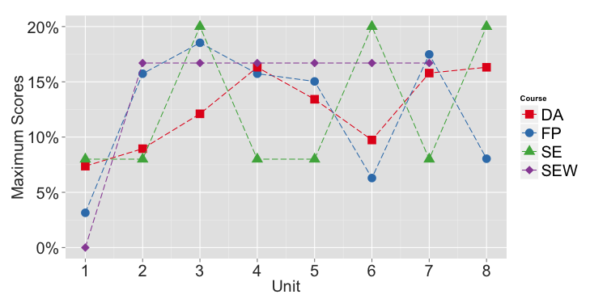
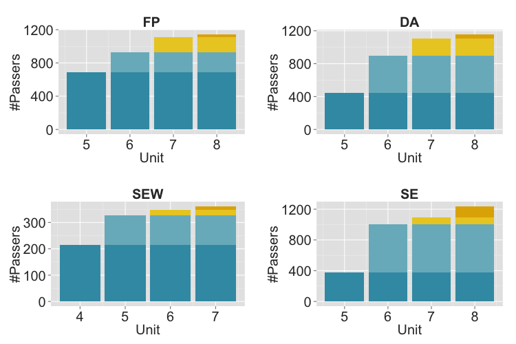

# Certificate Achievement Unlocked: How does MOOC learners' behaviour change?

Author: Yue Zhao, Dan Davis, Guanliang Chen, Christoph Lofi, Claudia Hauff and Geert-Jan Houben
Affiliation: Lambda Lab, Web Information Systems, TU Delft

## Abstract
Massive Open Online Courses (MOOCs) play an ever more central role in open education. However, in contrast to traditional classroom settings, many aspects of learner/user behavior in MOOCs are not well researched. In this work, we focus on modelling learner behavior in the context of continuous assessments with completion certificates, the most common assessment setup in MOOCs today. Here, learners can obtain a completion certificate once they obtain a required minimal score (typically somewhere between 50-70%) in continuous tests distributed through the duration of a MOOC.

In this setting, the course material or tests provided after "passing" do not contribute to earning the certificate, thus potentially affecting learner's behavior. Therefore, we explore how "passing" impacts MOOC learners: **do learners alter their behaviour after this point?** And if so how? While in traditional classroom-based learning the role of assessment and its influence on learning behaviour has been well-established, we are the first to provide answers to these questions in the context of MOOCs, providing valuable insights which can be used to design better courses in the future. As a result, we present a set of core behaviour patterns based on our extensive exploratory analysis of the log traces of more than 4,000 certificate-earning learners across four edX MOOCs.

## MOOC Dataset
We analyze the log traces of 4,000 learners who successfully completed one of four MOOCs offered on the edX platform -- they are summarized as following:

| ID  | Name                                   | Start   | End     | Units | Videos | Questions | Attempts | Registered | Engaged | Passed | Compl Rate |
| --- | -------------------------------------- |:-------:|:-------:| -----:| ------:| ---------:| --------:| ----------:| -------:| ------:| ----------:|
| FP  | Introduction to Functional Programming | 10/2015 | 01/2016 |   8   |   39   |   285     |    1     |     25,188 | 9,900 | 1,143| 4.54%      |
| DA  | Data Analysis: Take It to the MAX()    | 09/2015 | 11/2015 |   8   |   60   |   137     |    2     |     23,813 | 9,780 | 1,156| 4.85%      |
| SEW | Treatment of Urban Sewage              | 04/2016 | 06/2016 |   7   |   79   |    36     |    1     |     11,006 | 2,589 |   361| 3.28%      |
| SE  | Solar Energy                           | 09/2015 | 12/2015 |   8   |   61   |   128     |   1 - 3  |     26,718 | 12,723| 1,346| 5.04%      |

As the distribution of possible scores shows in Fig.1 (and with $\tau_{pass}=58%$ and $\tau_{pass}=60%$ in mind), all four MOOCs can be passed well before the final unit.



In Fig.2 we plot the _total_ number of learners who earned a certificate by the end of each (weekly) unit  --- starting at the first possible certificate-earning unit.



## 

## Welcome to GitHub Pages

You can use the [editor on GitHub](https://github.com/Yue-ZHAO/umap2017/edit/master/index.md) to maintain and preview the content for your website in Markdown files.

Whenever you commit to this repository, GitHub Pages will run [Jekyll](https://jekyllrb.com/) to rebuild the pages in your site, from the content in your Markdown files.

### Markdown

Markdown is a lightweight and easy-to-use syntax for styling your writing. It includes conventions for

```markdown
Syntax highlighted code block

# Header 1
## Header 2
### Header 3

- Bulleted
- List

1. Numbered
2. List

**Bold** and _Italic_ and `Code` text

[Link](url) and 
```

For more details see [GitHub Flavored Markdown](https://guides.github.com/features/mastering-markdown/).

### Jekyll Themes

Your Pages site will use the layout and styles from the Jekyll theme you have selected in your [repository settings](https://github.com/Yue-ZHAO/umap2017/settings). The name of this theme is saved in the Jekyll `_config.yml` configuration file.

### Support or Contact

Having trouble with Pages? Check out our [documentation](https://help.github.com/categories/github-pages-basics/) or [contact support](https://github.com/contact) and we’ll help you sort it out.
